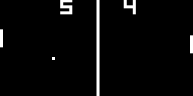

## Demo
* [http://fouramgames.com/swf/FireCHIP8.swf](http://fouramgames.com/swf/FireCHIP8.swf)
* P1 controls: 1 and Q
* P2 controls: 4 and R

## Background
* CHIP-8 is the interpreted language designed for an early virtual machine which enabled games to run on a wide variety of hardware
* [Wikipedia entry](http://en.wikipedia.org/wiki/CHIP-8)

## What's FireCHIP-8?
* A CHIP-8 emulator
* Written in Haxe, and is cross-platform
* The core, contained in the `src/emu` package, is independant from any framework/engine/renderer.
* The `src/engine` package contains classes that interface the core with the OpenFL framework.
* You'll notice that some sprites on the screen flicker noticeably. This is according to the specification. Historically, CHIP-8 implementations have usually added workarounds for this issue, and the "ghosting" effect on old screens made it less obvious.

## TODO:
* Figure out why the Stars demo isn't working, and why the Division Test program isn't finishing correctly
* Embedded program selector and load program from disk functionalities
* Test the rest of the games

## References used:
* http://devernay.free.fr/hacks/chip8/C8TECH10.HTM
* http://devernay.free.fr/hacks/chip8/chip8def.htm
* http://www.multigesture.net/articles/how-to-write-an-emulator-chip-8-interpreter
* http://en.wikipedia.org/wiki/CHIP-8#Opcode_table